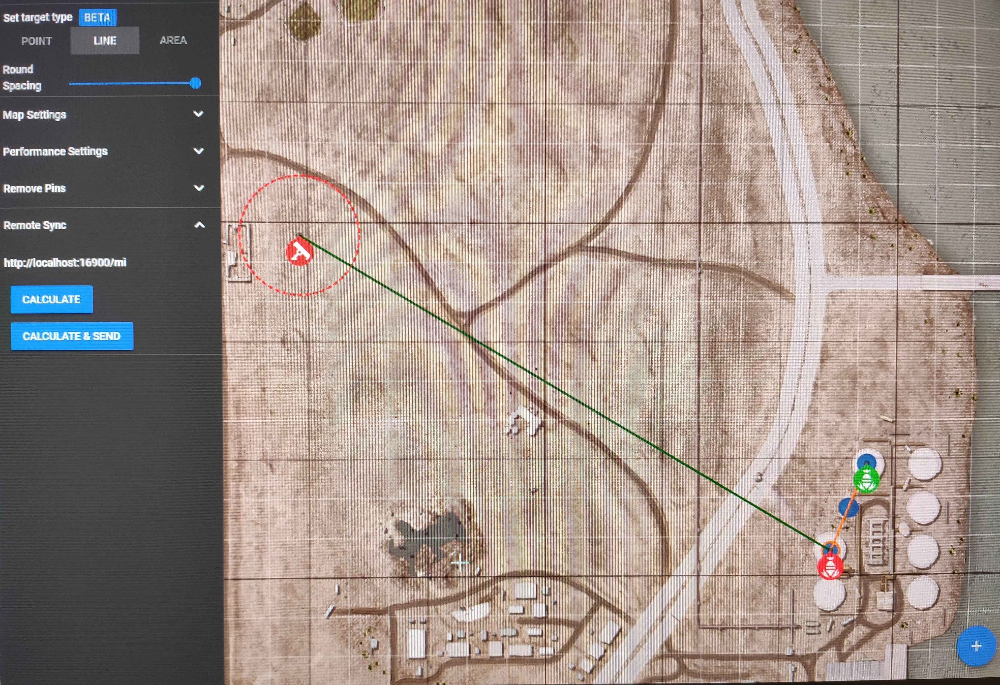
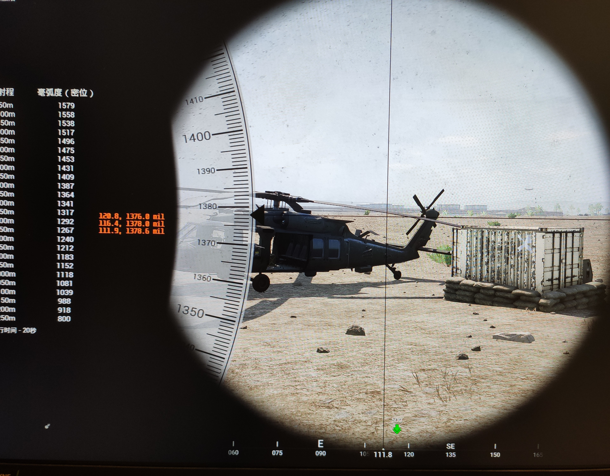
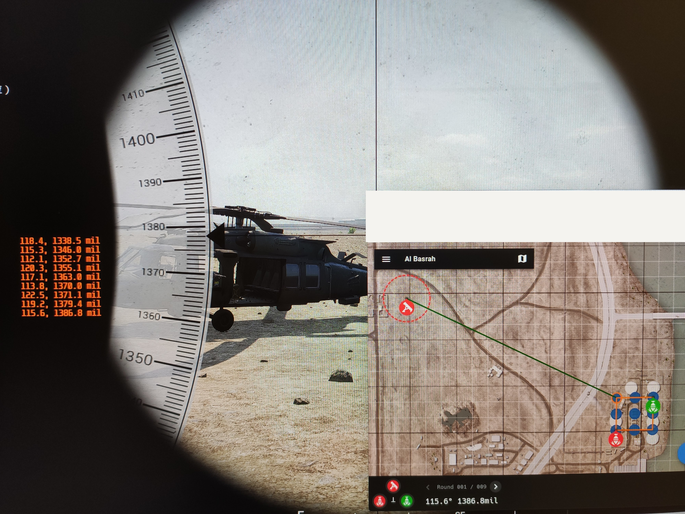

### Prerequisites
1. RivaTuner Statistics Server

    Official download from [Guru3D](https://www.guru3d.com/page/rivatuner-rtss-homepage/)

1. RivaTuner Statistics Server cli (already included in the release package)

    Github download from [RTSS-CLI](https://github.com/Erruar/RTSS-CLI)

### Usage
1. Using the repo `https://github.com/916980name/squadmc`. Or access `http://squadmc.bebegentle.serv00.net/`
2. Run the release executable binary `squadmc-localserver.exe`
3. Mark the targets on the map, click `Remote Sync -> calculate & send`
4. Angle and mil of every target will shown on the screen in game




### Commandline Arguments
```
-clipath string
    The RTSS cli exe file location (default ".\\saku-rtss-cli\\Saku RTSS CLI.exe")
-port int
    The server runs in local port (default 16900)
```
